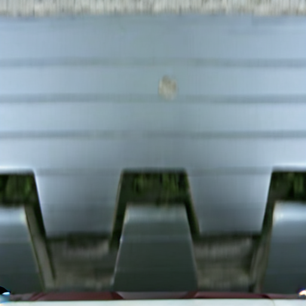
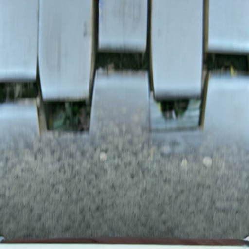

<!-- This model card has been generated automatically according to the information the training script had access to. You
should probably proofread and complete it, then remove this comment. -->


# LoRA text2image fine-tuning - chiang777/expansion_joint-lora
These are LoRA adaption weights for runwayml/stable-diffusion-v1-5. The weights were fine-tuned on the None dataset. You can find some example images in the following. 







## Intended uses & limitations

#### How to use

```python
# TODO: add an example code snippet for running this diffusion pipeline
```

#### Limitations and bias

[TODO: provide examples of latent issues and potential remediations]

## Training details

[TODO: describe the data used to train the model]